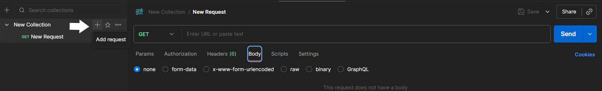
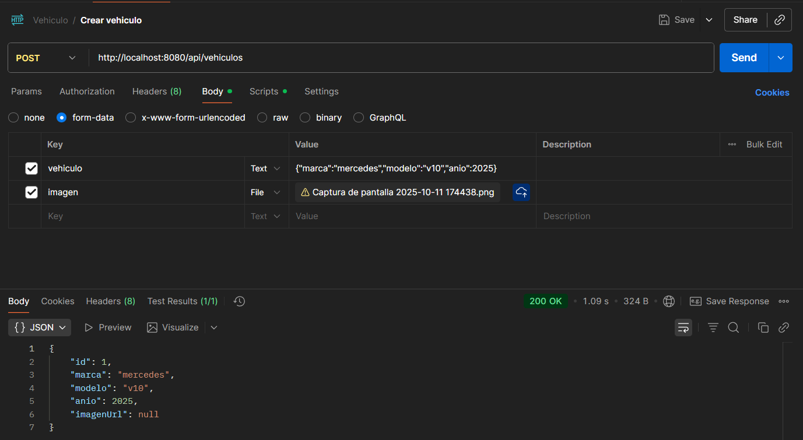
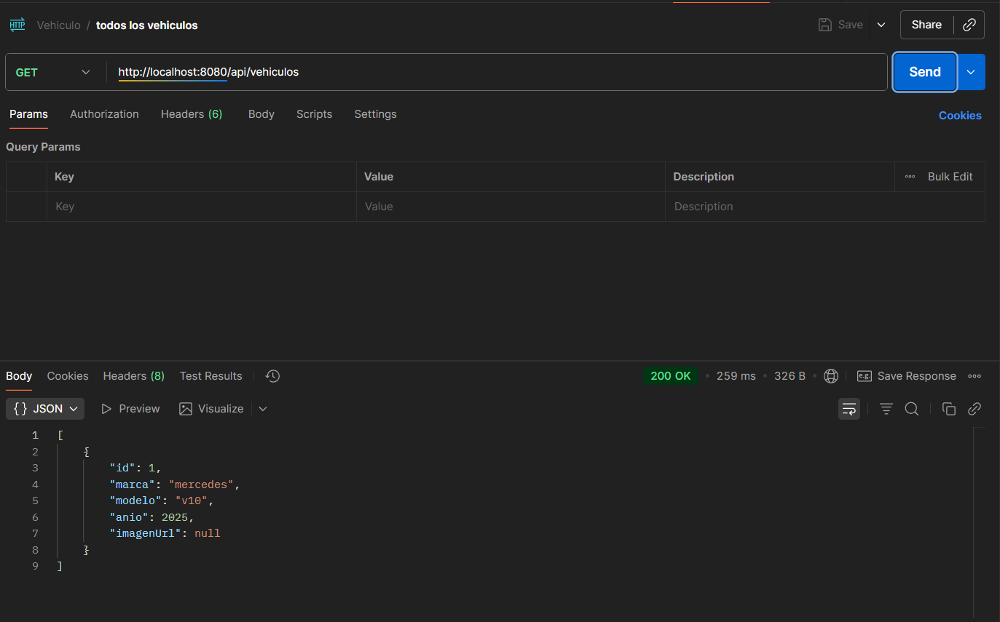
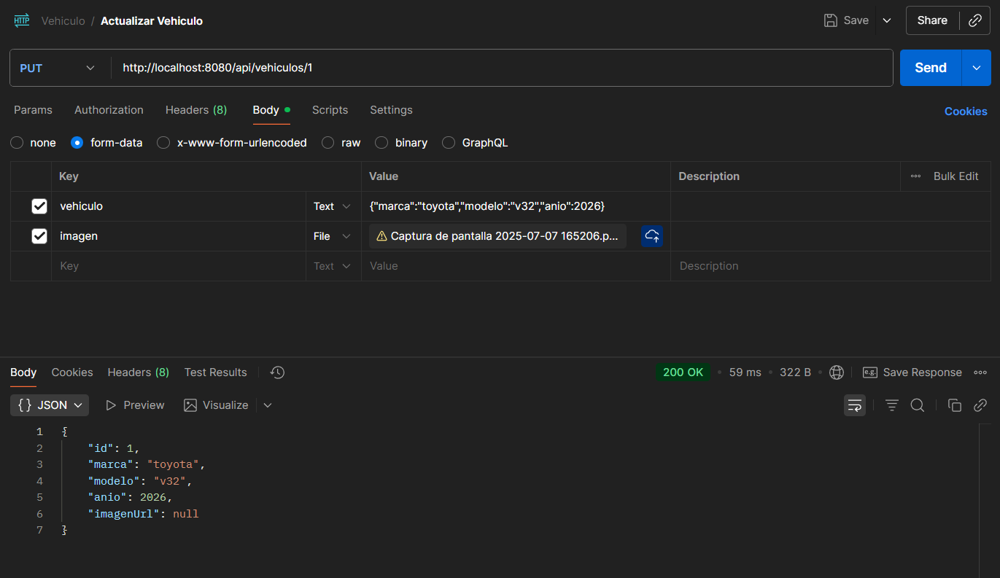
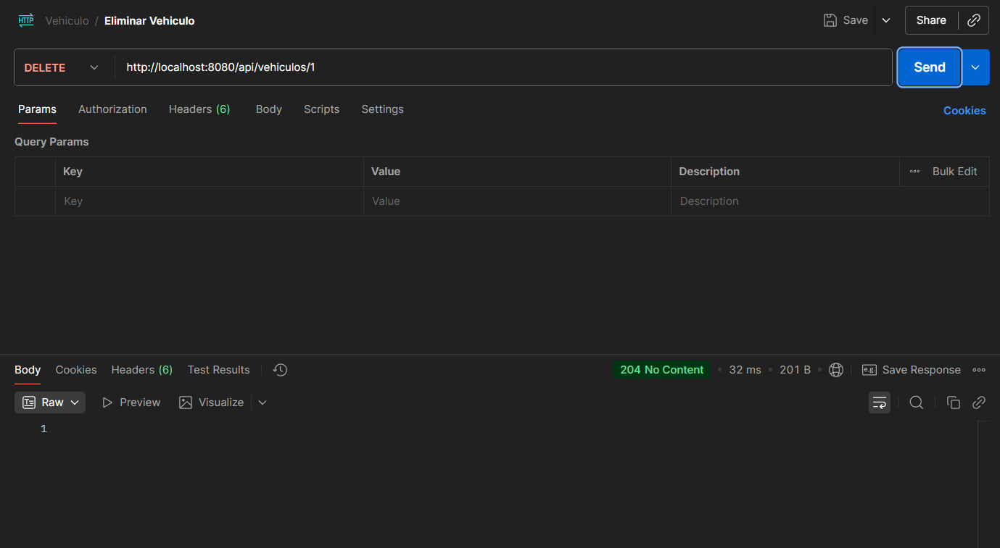
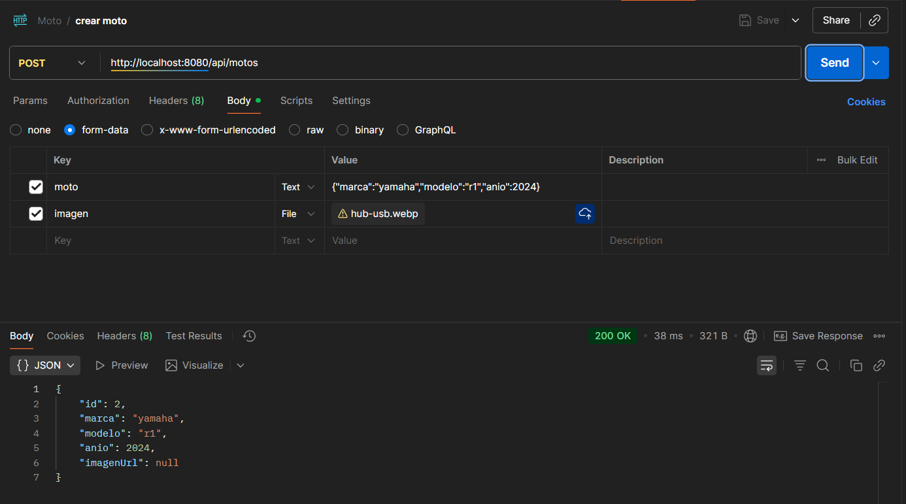
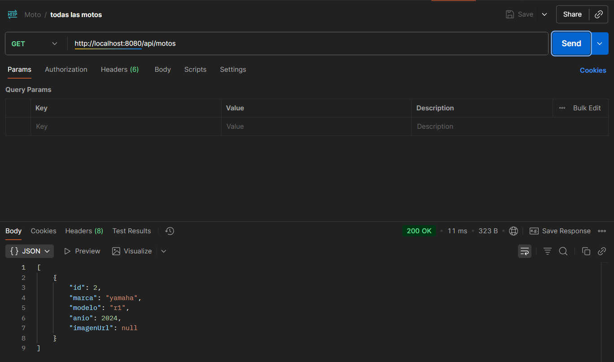
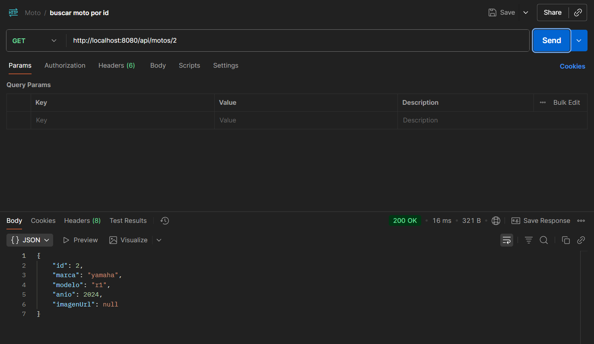
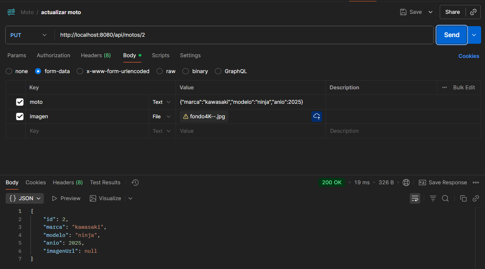
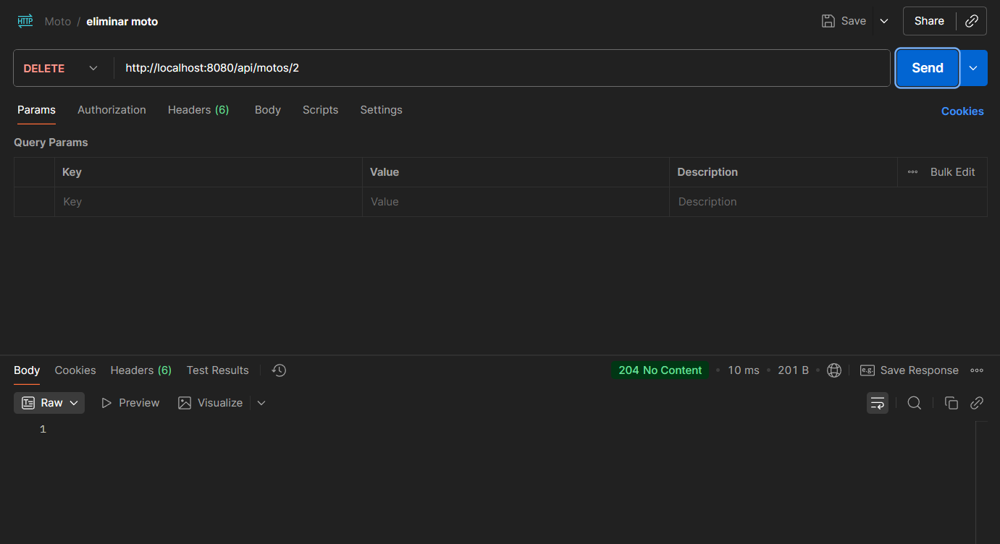

## 🚗 Aplicacion Vehiculos,Moto + Springboot  

Este proyecto fue creado en Java usando Spring Boot y Maven.  
Su objetivo es poder crear un vehiculo y moto con la informacion necesaria  
(Marca,Modelo,año)  

# 📄 Características  
Hecho con Spring Boot + Java  
API REST con endpoints documentados  
probado con PostMan  

# 💾 Arquitectura usada  
**⁍ Controller:** Es el encargado de los endpoints  
**⁍ Service:** Contiene la logica del vehiculo/moto  
**⁍ Repository:** Gestiona el almacenamiento y lectura de datos en archivos JSON  
**⁍ Model:** Define las entidades principales del sistema  
**⁍ Dto:** Es el bus que permite la transaccion de datos entre backend y frontend  

## 📤 Aplicaciones Principales (Obligatorias)
‣ 🟦 **Visual Studio Code** | Esta es la App que permite editar todo el codigo, ejecutarlo y instalar las extensiones. | [Descargar](https://vscode.download.prss.microsoft.com/dbazure/download/stable/7d842fb85a0275a4a8e4d7e040d2625abbf7f084/VSCodeUserSetup-x64-1.105.1.exe)  
‣ 🟫 **Java SE Development Kit (JDK)** | Es el paquete que contiene todo lo necesario para desarrollar y ejecutar programas java. | [Descargar](https://download.oracle.com/java/25/latest/jdk-25_windows-x64_bin.exe)  
‣ 🟧 **PostMan** | Esta es la App que nos permite hacer las pruebas de vehiculo y moto para saber si estan bien | [Descargar](https://dl.pstmn.io/download/latest/win64)  


## 📦 Extensiones Usadas
▪ ☕ **Extension Pack for Java** | Incluye todo lo necesario para trabajar con proyectos Java (Debug, Maven, etc). | [Descargar](https://marketplace.visualstudio.com/items?itemName=vscjava.vscode-java-pack)  
▪ 🐞 **Debugger for Java** | Depurador oficial de Microsoft para proyectos Java. | [Descargar](https://marketplace.visualstudio.com/items?itemName=vscjava.vscode-java-debug)  
▪ 💜 **Maven for Java** | Permite manejar dependencias y construir proyectos con Maven. | [Descargar](https://marketplace.visualstudio.com/items?itemName=vscjava.vscode-maven)  
▪ ⚙️ **Project Manager for Java** | Gestión de proyectos Java dentro de VS Code. | [Descargar](https://marketplace.visualstudio.com/items?itemName=vscjava.vscode-java-dependency)  
▪ 💚 **Spring Boot Extension Pack** | Extensiones esenciales para desarrollar con Spring Boot. | [Descargar](https://marketplace.visualstudio.com/items?itemName=pivotal.vscode-boot-dev-pack)  
▪ 🚀 **Spring Boot Dashboard** | Permite correr, detener y monitorear proyectos Spring Boot fácilmente. | [Descargar](https://marketplace.visualstudio.com/items?itemName=vscjava.vscode-spring-boot-dashboard)  

## ⚙️ Instalación y ejecución
## |Paso 1️⃣|  
› Lo principal es descargar **JDK** , **Visual Studio Code** , **PostMan** desde la seccion de (📤 Aplicaciones Principales)  

## |Paso 2️⃣|  
› Abrir **Visual Studio code** y **postman**(es necesario crear una cuenta)  

## |Paso 3️⃣|  
› Descargar las extensiones.  

  

## |Paso 4️⃣|  
› Abrir el proyecto (Se tiene que descargar previamente, desde la parte de "<> code" y "Download Zip", luego se extrae en una carpeta) para abrirla se hace:  

  

## |Paso 5️⃣|  
› Para correr el proyecto desde **Spring Boot**, se necesitan las extensiones que se ubican en (📦 Extensiones Usadas), luego irse al icono de Spring y hacer esto:  

  

## |Paso 6️⃣|  
› Para probar que el proyecto funciona necesitamos Postman, que es una de las Apps que se necesitan descargar.  
Tenemos que ir a Collection/New/Add request  
Asi: 

  

## |Paso 7️⃣|  
› Luego de crear el **New Request**, necesitamos seguir estos 5 pasos para que funcione de manera correcta.  
1. Colocar de manera correcta la **URL** en la mayoria de casos usa el puerto 8080 ( http://localhost:8080/api/vehiculos )
2. Verificar que el endpoint, sea el correcto, para saber cual usar se puede verificar desde el apartado de controlador.
3. Irse a la parte de body para copiar el codigo correspondiente.  

``` java{"marca":"mercedes","modelo":"v10","anio":2025} ``` 

4. Opcional puedes colocar la imagen de un vehiculo y tambien se carga (tiene que ser una URL de un archivo de tu computadora)    

5. Le dariamos click al boton de **"Send"** para enviarlo y que se muestre el Vehiculo ya creado.

Esto tiene que quedar asi:  

  

## 📂 Otros Metodos (Vehiculo 🚗)  

# Mostrar Todos los Vehiculos Creados.  

• En el **URL** debe ir asi: http://localhost:8080/api/vehiculos    
• Metodo: **GET**  
  

# Mostrar Vehiculo por Id.  

• En el **URL** debe ir asi: http://localhost:8080/api/vehiculos/{id_vehiculo}    
• Metodo: **GET**  
• {id_vehiculo}: Aqui va el id del vehiculo creado    
  

# Actualizar Vehiculo.  

• En el **URL** debe ir asi: http://localhost:8080/api/vehiculos/{id_vehiculo}    
• Metodo: **PUT**  
• {id_vehiculo}: Aqui va el id del vehiculo creado    
• Codigo: ``` java{"marca":"toyota","modelo":"v32","anio":2026} ```  
  

# Eliminar Vehiculo.  

• En el **URL** debe ir asi: http://localhost:8080/api/vehiculos/{id_vehiculo}    
• Metodo: **DELETE**  
• {id_vehiculo}: Aqui va el id del vehiculo creado    
  


## 📂 Otros Metodos (Moto 🏍️)  

# Crear Moto.  

• En el **URL** debe ir asi: http://localhost:8080/api/motos    
• Metodo: **POST**    
• Codigo: ``` java{"marca":"yamaha","modelo":"r1","anio":2024} ```  
  

# Mostrar Todas las Motos Creadas.  

• En el **URL** debe ir asi: http://localhost:8080/api/motos    
• Metodo: **GET**  
  

# Mostrar Moto por Id.  

• En el **URL** debe ir asi: http://localhost:8080/api/motos/{id_moto}    
• Metodo: **GET**  
• {id_moto}: Aqui va el id de la moto creada    
  

# Actualizar Moto.  

• En el **URL** debe ir asi: http://localhost:8080/api/vehiculos/{id_moto}  
• Metodo: **PUT**  
• {id_moto}: Aqui va el id de la moto creada   
• Codigo: ``` java{"marca":"kawasaki","modelo":"ninja","anio":2025} ```  
  

# Eliminar Moto.  

• En el **URL** debe ir asi: http://localhost:8080/api/vehiculos/{id_Moto}    
• Metodo: **DELETE**  
• {id_moto}: Aqui va el id de la moto creada   
  
